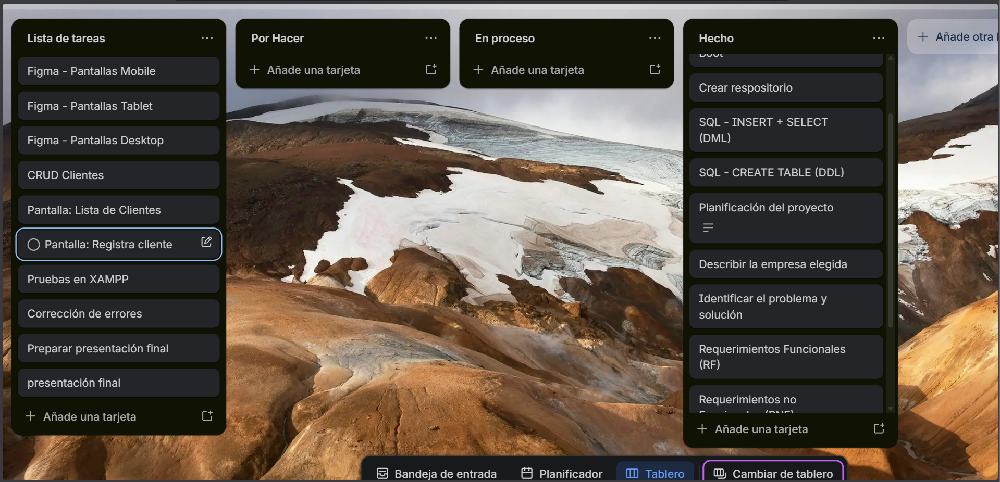

## Gestión del Proyecto (Trello)

Puedes visualizar el estado actual y el flujo de trabajo del proyecto en nuestro tablero de Trello.

 [Trello](https://trello.com/b/5CGTud9F/voleyplayadiloz)



# Sistema Web de Gestión de Reservas - Voley Playa Diloz

Sistema web para la gestión de alquiler de canchas deportivas con control de horarios y registro de pagos en tiempo real. Desarrollado como proyecto final para el curso de Desarrollo de Software en **SENATI**.

## Descripción del negocio
* **Nombre:** VOLEY PLAYA DILOZ
* **Giro:** Alquiler de espacios deportivos (Canchas de Voley Playa).
* **Tamaño:** Pequeña empresa de servicios deportivos.
* **Contexto:** Actualmente la gestión se realiza de forma manual en cuadernos, generando desorden y errores en los horarios.
* **Justificación:** Centralizar la información en una plataforma digital para evitar la duplicidad de horarios y profesionalizar el control de ingresos.

## Identificar el problema y solución
* **Problema:** Errores en el registro manual, pérdida de datos de clientes, cruce de horarios en horas pico y falta de control sobre los pagos.
* **Solución tecnológica:** Plataforma web con **Java Spring Boot** y **MariaDB** que automatiza el flujo de reservas y valida la disponibilidad en tiempo real.

## Requerimientos Funcionales
| Código | Descripción |
|---|---|
| RF01 | El sistema debe permitir el inicio de sesión seguro para el administrador. |
| RF02 | El sistema debe gestionar datos de clientes (DNI, Nombre, Apellido, Celular). |
| RF03 | El sistema debe registrar reservas vinculando Cliente + Cancha + Horario. |
| RF04 | El sistema debe validar automáticamente que no existan cruces de horario. |
| RF05 | El sistema debe registrar pagos (monto y método) vinculados a cada reserva. |

## Requerimientos No Funcionales
| Código | Tipo | Descripción |
|---|---|---|
| RNF01 | Seguridad | Acceso restringido mediante autenticación de usuario y contraseña. |
| RNF02 | Usabilidad | Interfaz intuitiva desarrollada con Bootstrap 5. |
| RNF03 | Integridad | Garantizar la persistencia de datos mediante Spring Data JPA. |

## Stack Tecnológico
1. **Trello** = Gestión del proyecto mediante metodología Ágil (Kanban).
2. **Figma** = Diseño de la interfaz UI/UX y prototipo.
3. **MariaDB** = Motor de base de datos relacional (vía XAMPP).
4. **IntelliJ IDEA** = IDE principal para Backend y Frontend.
5. **Spring Boot 3** = Framework para la lógica de negocio y API REST.

## Tecnologías utilizadas
- **Java 17** (Versión estable LTS).
- **Maven** (Gestor de dependencias).
- **HTML5, CSS3 (Bootstrap 5), JavaScript** (Frontend).
- **Git / GitHub** (Control de versiones).

## Base de datos
### Modelo Relacional (MR)


### Script de Creación (DDL)
```sql
-- 1. Crear la base de datos
CREATE DATABASE IF NOT EXISTS voley_diloz;
USE voley_diloz;

-- 2. Tabla Cliente
-- El DNI se ubica aquí para identificar a la persona físicamente.
CREATE TABLE cliente (
    id_cliente INT AUTO_INCREMENT PRIMARY KEY,
    dni CHAR(8) NOT NULL UNIQUE, -- Agregado aquí: Identificador único de la persona
    nombre VARCHAR(100) NOT NULL,
    apellido VARCHAR(100) NOT NULL
) ENGINE=InnoDB;

-- 3. Tabla Usuario
-- Gestión de credenciales vinculadas a un cliente existente.
CREATE TABLE usuario (
    id_usuario INT AUTO_INCREMENT PRIMARY KEY,
    username VARCHAR(50) NOT NULL UNIQUE,
    password VARCHAR(255) NOT NULL,
    id_cliente INT UNIQUE,
    CONSTRAINT fk_usuario_cliente FOREIGN KEY (id_cliente) 
        REFERENCES cliente(id_cliente)
) ENGINE=InnoDB;

-- 4. Tabla Cancha (Mantiene tu estructura anterior)
CREATE TABLE cancha (
    id_cancha INT AUTO_INCREMENT PRIMARY KEY,
    nombre_cancha VARCHAR(50) NOT NULL,
    descripcion VARCHAR(200)
) ENGINE=InnoDB;

-- 5. Tabla Reserva (Lógica de calendario)
CREATE TABLE reserva (
    id_reserva INT AUTO_INCREMENT PRIMARY KEY,
    fecha DATE NOT NULL,
    hora_inicio TIME NOT NULL,
    hora_fin TIME NOT NULL,
    id_cliente INT,
    id_cancha INT,
    CONSTRAINT fk_reserva_cliente FOREIGN KEY (id_cliente) 
        REFERENCES cliente(id_cliente),
    CONSTRAINT fk_reserva_cancha FOREIGN KEY (id_cancha) 
        REFERENCES cancha(id_cancha)
) ENGINE=InnoDB;

-- ==============================================================
-- DATOS DE PRUEBA ACTUALIZADOS
-- ==============================================================
INSERT INTO cliente (dni, nombre, apellido) VALUES ('74581236', 'Julio', 'Lozano');

-- El usuario ahora solo gestiona el acceso
INSERT INTO usuario (username, password, id_cliente) 
VALUES ('admin', 'admin123', 1);

INSERT INTO cancha (nombre_cancha, descripcion) VALUES ('Cancha 1', 'Arena de playa premium');
